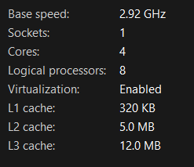
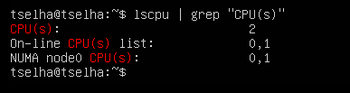
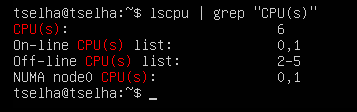
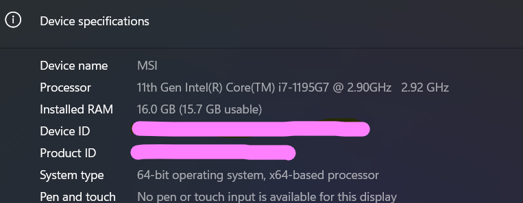
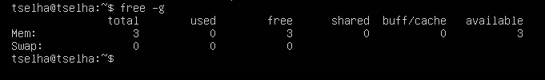
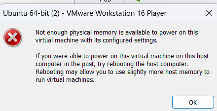

# KN01-Virtualisierung

### Host CPU Info:
Ctrl + shift + esc > open Perfomance Tab  

Host CPU cores: 4
CPU: Central Processing Unit
executes instructions of a computer program, such as arithmetic, logic, controlling, and input/output operations. 

### Konsolen-Ausgabe der CPUs bei weniger CPU als Gast-System:

### Konsolen-Ausgabe der CPUs bei mehr CPU als Gast-System:

### Host RAM Info:
Settings > System > About

Host RAM: 16.0 GB

### Konsolen-Ausgabe des RAM bei weniger RAM als Gast-System:

### Fehlermeldung:

### Warum die Fehlermeldung?

Der Gesamtspeicher der ausgeführten virtuellen Maschinen plus der Overhead für die VMware Server-Prozesse darf nicht größer sein als der physische Arbeitsspeicher des Hosts.
