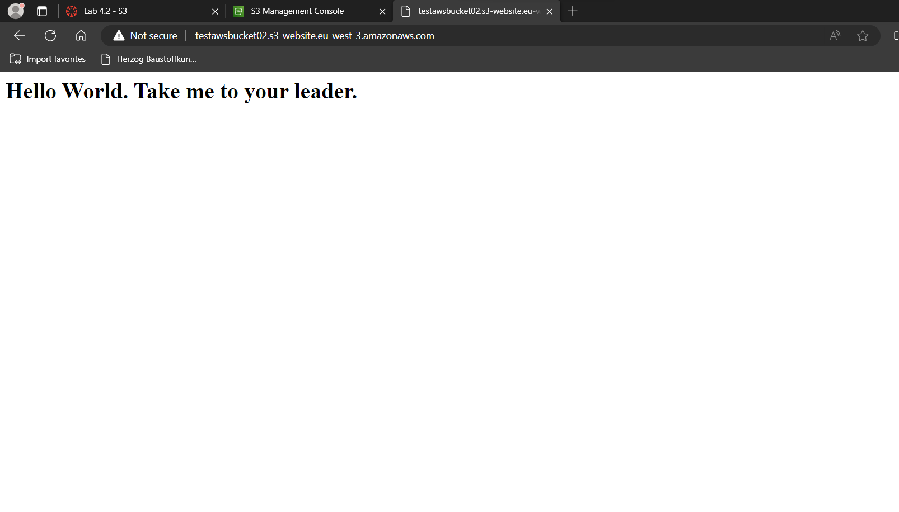

# laaS - Virtuelle Server
## A. AWS Kurs

### a. Lab 4.1 - EC2

1. HTML-Seite, inkl. URL: 
  

2. Liste der EC2-Instanzen:
  

3. Details der Web Server-Instanz (öffentliche IP sichtbar):

4. Security-Group: Liste der Inbound-Regeln:

### b. Lab 4.2 - S3

1. Liste der Buckets:

2. HTML-Seite, inkl. URL:
  

3. Liste der Dateien im Bucket:
  

4. Eigenschaften von "Static website hosting":

## B. Zugriff mit SSH-Key

1. Screenshot mit dem ssh-Befehl und des Resultats unter Verwendung des ersten Schlüssels:

2. Screenshot mit dem ssh-Befehl und des Resultats unter Verwendung des zweiten Schlüssels:

3. Screenshot der Instanz-Detail (oder Liste), so dass der verwendete Schlüssel sichtbar ist:

## C. Installation von Web- und Datenbankserver

Screenshots der funktionierenden Webseiten (mit sichtbarer URL): 

1. 

2. 

3. 

