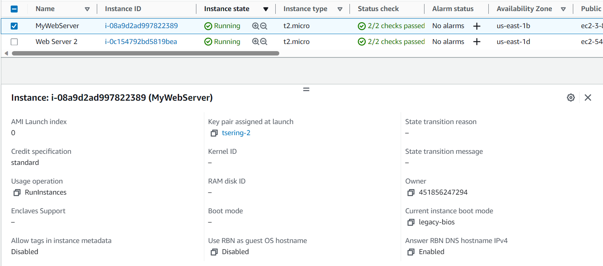
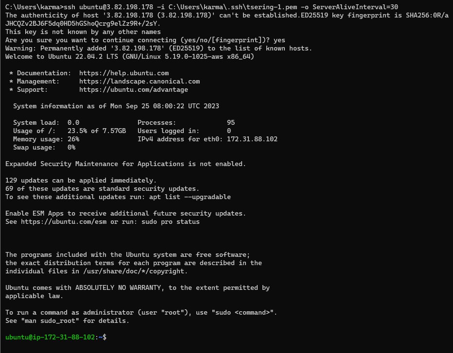
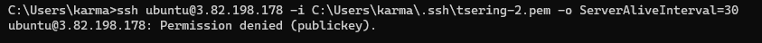
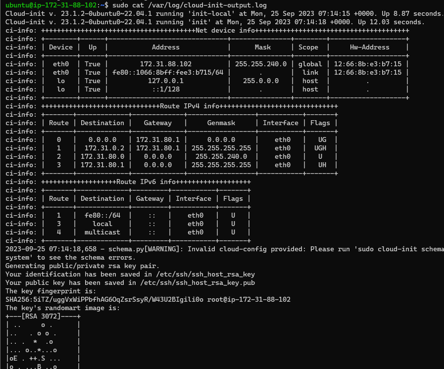
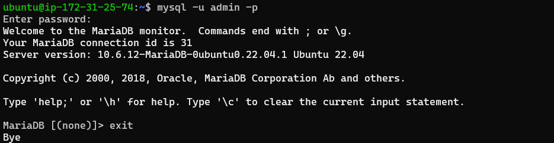
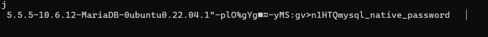
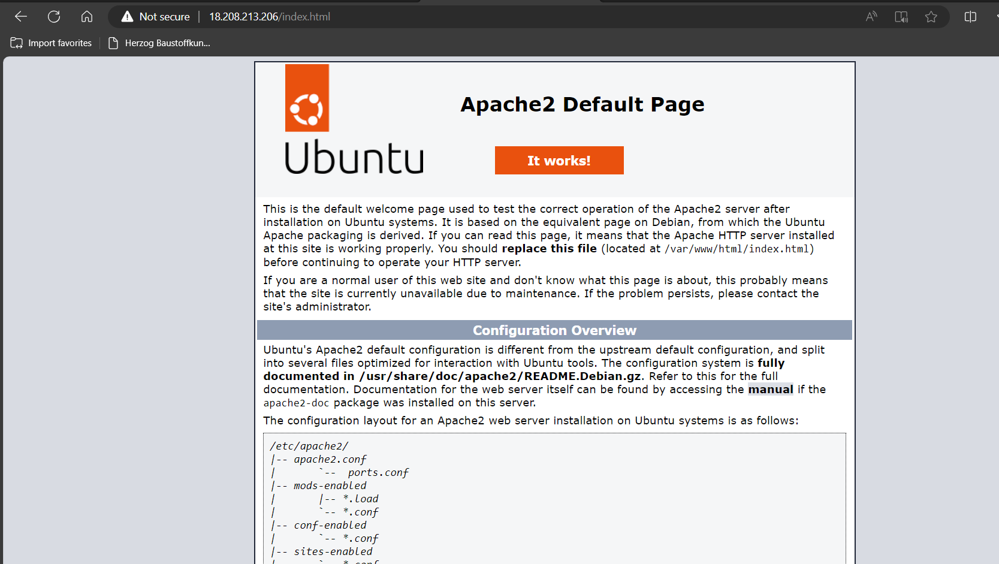
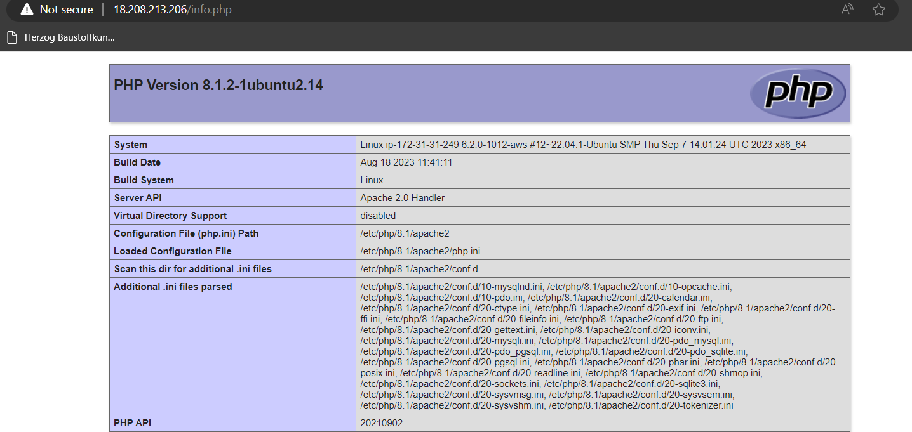
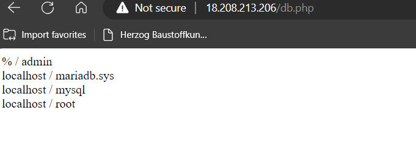
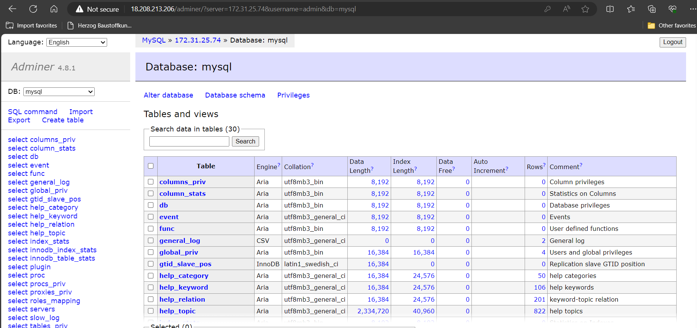

# KN03: Cloud-Init und AWS

## A. Cloud-init Datei Verstehen
1. Die dokumentierte YAML-Datei

~~~ruby
#cloud-config (This is a comment indicating the start of a cloud-config script.)
users: # This line starts the user configuration for cloud-config.
  - name: ubuntu # Defines a user named "ubuntu".
    sudo: ALL=(ALL) NOPASSWD:ALL # Grants the "ubuntu" user sudo privileges without requiring a password.
    groups: users, admin # Assigns the "ubuntu" user to the "users" and "admin" groups.
    home: /home/ubuntu # Sets the home directory for the "ubuntu" user to "/home/ubuntu."
    shell: /bin/bash # Specifies the default shell for the "ubuntu" user as "/bin/bash."
    ssh_authorized_keys: # Defines the SSH authorized keys section for the "ubuntu" user.
      - ssh-rsa # Adds an SSH public key
      AAAAB3NzaC1yc2EAAAADAQABAAABAQC0WGP1EZykEtv5YGC9nMiPFW3U3DmZNzKFO5nEu6uozEHh4jLZzPNHSrfFTuQ2GnRDSt+XbOtTLdcj26+iPNiFoFha42aCIzYjt6V8Z+SQ9pzF4jPPzxwXfDdkEWylgoNnZ+4MG1lNFqa8aO7F62tX0Yj5khjC0Bs7Mb2cHLx1XZaxJV6qSaulDuBbLYe8QUZXkMc7wmob3PM0kflfolR3LE7LResIHWa4j4FL6r5cQmFlDU2BDPpKMFMGUfRSFiUtaWBNXFOWHQBC2+uKmuMPYP4vJC9sBgqMvPN/X2KyemqdMvdKXnCfrzadHuSSJYEzD64Cve5Zl9yVvY4AqyBD aws-key       
ssh_pwauth: false # Disables SSH password authentication for all users.
disable_root: false # Allows root login via SSH.
package_update: true # Updates the package repository and installs the latest versions of packages.
packages: # Starts the package installation section.
  - curl # Specifies the installation of the "curl" package
  - wget # Specifies the installation of the "wget" package
~~~

## B. SSH-Key und Cloud-init
1. angepasste Cloud-init Konfiguration als Datei:  
[Adjusted Cloud-init](angepasste-cloud-init.yaml)

2. Screenshot der Details oder Liste der Instanz, welcher den verwendeten Key zeigt:  
  

3. Screenshot mit dem ssh-Befehl und des Resultats unter Verwendung des ersten Schlüssels:
  

4. Screenshot mit dem ssh-Befehl und des Resultats unter Verwendung des zweiten Schlüssels:
  

5. Screenshot mit dem Auszug aus dem Cloud-Init-Log:
  

 

## C. Template
[template](346.pub)

## D. Auftrennung von Web- und Datenbankserver
### Beweisführung DB Server
1. Screenshot der Befehl und die CLI von mysql:
  

2. Beweis dass der Zugriff von meinem lokalen System, aud ie externe Datenbank möglich ist.
  

3. Cloud-Init-Datei  
[Cloud-init-db](cloud-init-db.yaml)

### Beweisführung Webserver
1. Screenshot der URL (index.html, info.php, db.php) und des Inhalts:
  
  
  

2. Rufen Sie Adminer auf (http://ihre-ip/adminer/), verbinden Sie sich mit dem DB-Server und
zeigen Sie mit Screenshots, dass die Verbindung funktioniert:
  

3. die Cloud-Init-Datei:  
[Cloud-init-web](cloud-init-web.yaml)

