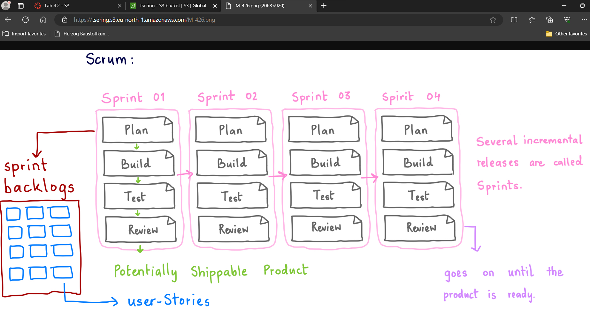
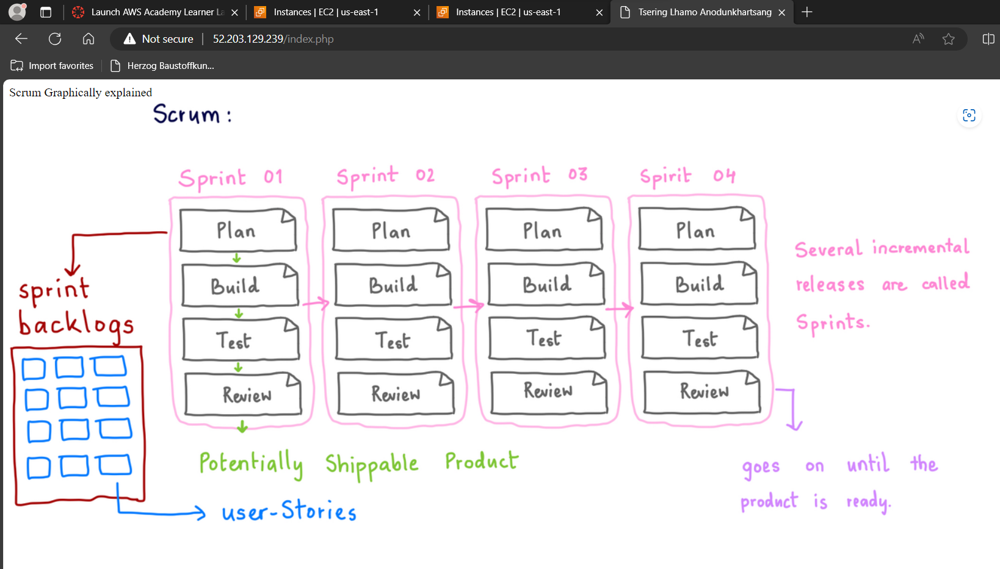

# KN04: Cloud-init / Storage
## A. Bild erstellen und auf S3 hosten
#### 1. Screenshot der S3-Objekte im Bucket: 
  

#### 2. screenshot des Bildes im Browser (mit sichtbarer URL):
  

## B. Web-Server mit PHP-Seite hinzufügen
#### 1. Neues Cloud-Init für die Web-Instanz:
[Cloud-init](cloud-init.yaml)

#### 2. Screenshot der Seite image.php (mit sichtbarer URL):
  

## C. Elastic Block Storage (EBS) hinzufügen
#### 1. Screenshots der Liste der EBS (2 Volumen) der Instanz. Alle Spalten sollen sichtbar sein:

## D. Speichereigenschaften erkennen
#### 1. Kategorisierung:

#### 2. Erklärung/Begründung zu der Kategorisierung: