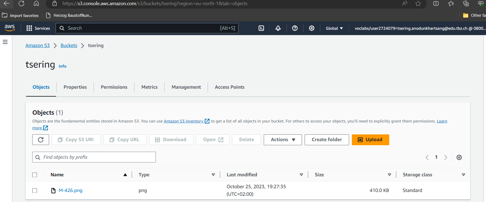

# KN04: Cloud-init / Storage
## A. Bild erstellen und auf S3 hosten
#### 1. Screenshot der S3-Objekte im Bucket: 
  

#### 2. screenshot des Bildes im Browser (mit sichtbarer URL):
  

## B. Web-Server mit PHP-Seite hinzufügen
#### 1. Neues Cloud-Init für die Web-Instanz:
[Cloud-init](cloud-init.yaml)

#### 2. Screenshot der Seite image.php (mit sichtbarer URL):
  

## C. Elastic Block Storage (EBS) hinzufügen
#### 1. Screenshots der Liste der EBS (2 Volumen) der Instanz. Alle Spalten sollen sichtbar sein:
  

## D. Speichereigenschaften erkennen
#### 1. Kategorisierung:

|                         | Typ           | Persistent |
| :---------------------  | :------------ | :----------|
| EBS Root                | hot           | ja         |
| EBS Zusätliches Volumen | cold          | ja         |
| S3                      | hot           | ja         |

#### 2. Erklärung/Begründung zu der Kategorisierung:
EBS Root:  
EBS Root volumes are "hot" storage because of its high-performance and low-latency storage providing fast access to data. EBS root volumes are also persistent. The data is retained even if the EC2 instance is stopped or terminated.  

EBS Zusätzliches Volumen:  
Personally I would use/configure the EBS additional volume of 30 GB as a "cold" storage. This volume would be for backup purposes. This volume woud be persistent because EBS volumes are designed to provide durable and persistent storage.
  

S3:   
There are different types of S3. Because I used S3 Standard. The storage would be "hot". It is specifically designed for frequently accessed data. All data in S3 is persistent. S3 is designed for durability and data retention. 