# KN05: Netzwerk / Sicherheit

## A. Diagram erstellen
#### Diagram als Bild:
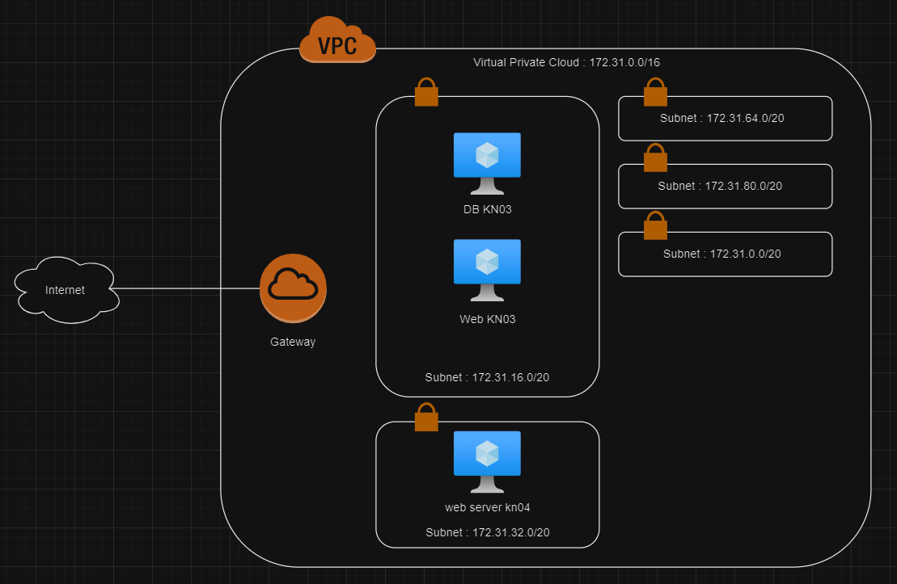

## B. Subnetz und privaten IP wählen
#### 1. Screenshot der Subnetzen, die die Namen:
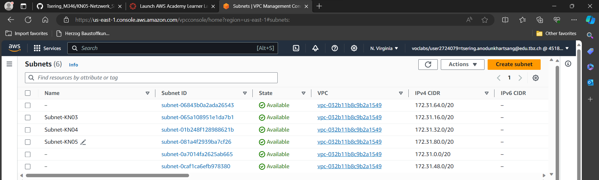

#### 2. Zwei definierte IPs für Web- und DB-Server/Instanz:
KN05 Subnet: 172.31.80.0/20 (Range: )
- Web-server: 172.31.83.119  
- DB-Server: 172.31.83.131 

## C. Objekte und Instanzen erstellen
#### 1. Screenshot der Liste der Sicherheitsgruppe mit sprechenden Namen/Feldern:
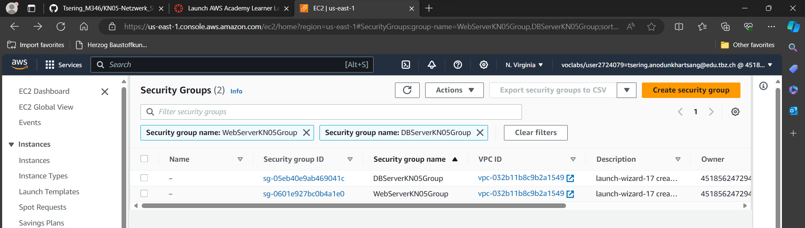

#### 2. Screenshot der Inbound-Regel für die DB-Sicherheitsgruppe:
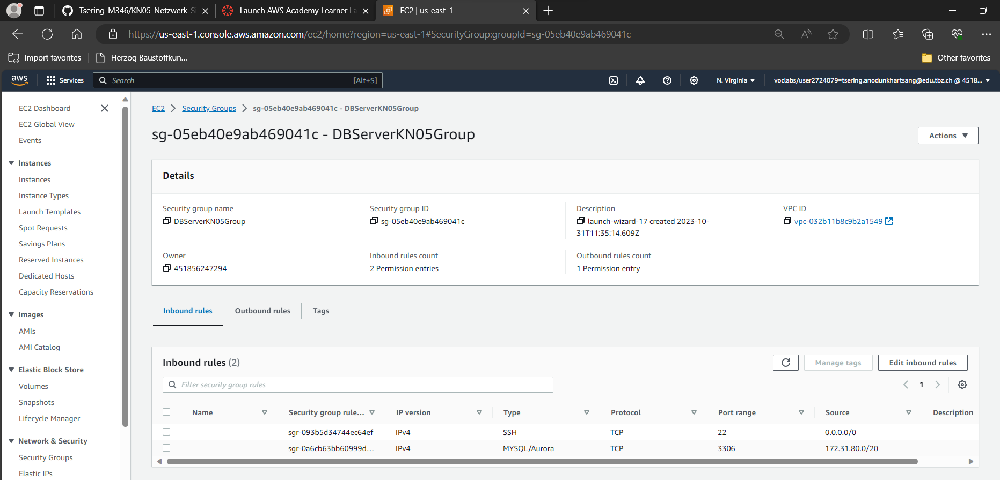

#### 3. Screenshot der Liste der Elastic IPs mit sprechenden Namen: 
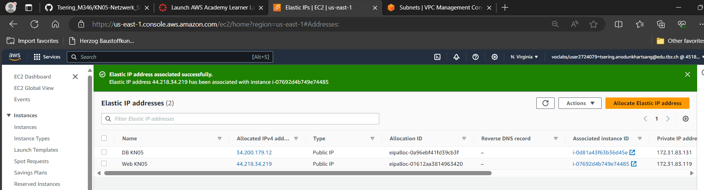

#### 4. Zeigen Sie, dass Sie nun alle drei Seiten aufrufen können (index.html, info.php und db.php): 
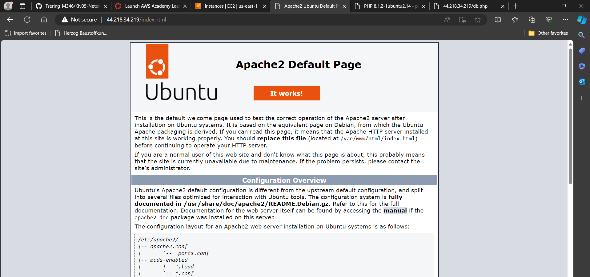
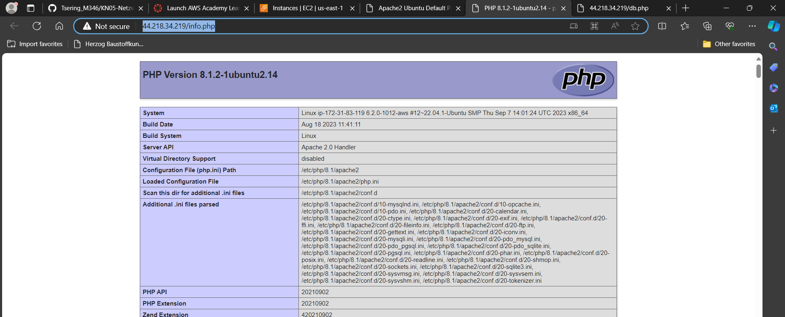
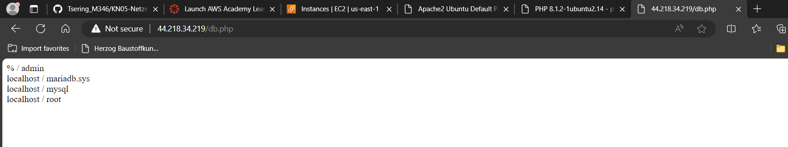

#### 5. Screenshot der Liste der Instanzen, wenn beide Instanzen gestoppt sind. Das Feld deröffentlichen IP und der Status (gestoppt) müssen sichtbar sein: 
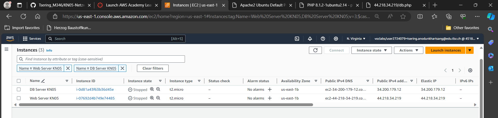

#### 6. Screenshot der Details beider Instanzen, so dass die Subnet ID sichtbar ist:
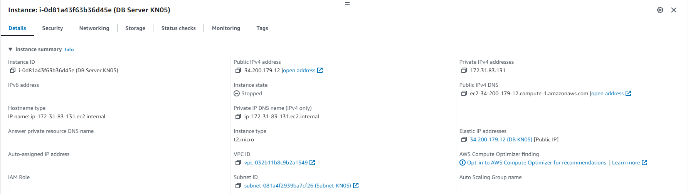
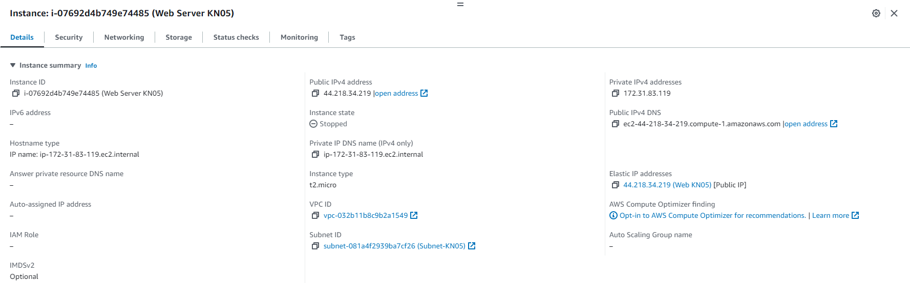

#### 7. Laden Sie die aktualisierten Cloud-init Konfigurationen hoch in Git. Im Web-Konfig, sollte die IP angepasst sein:
[Cloud-init-web](web-config.yaml)  
[Cloud-init-db](db-config.yaml)

