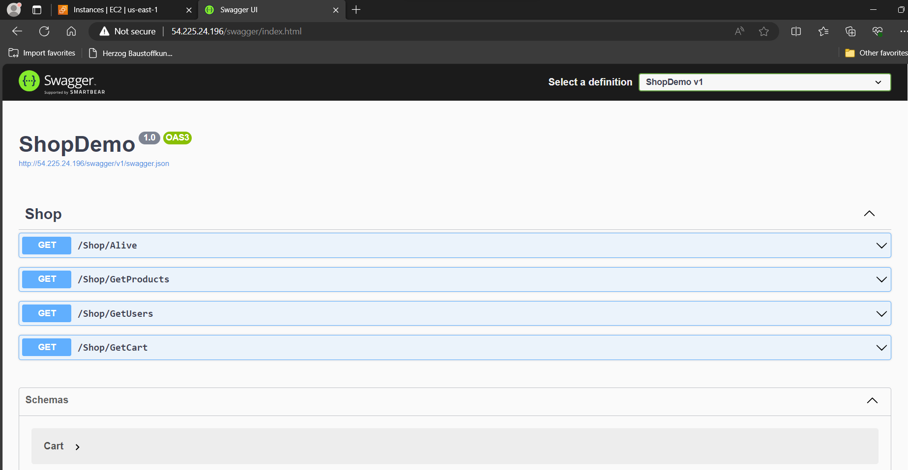
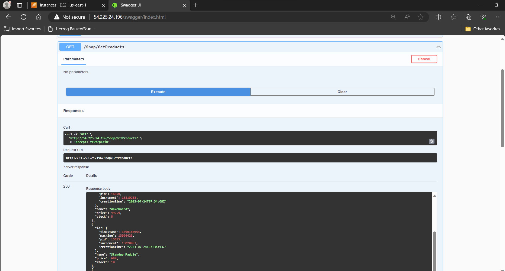
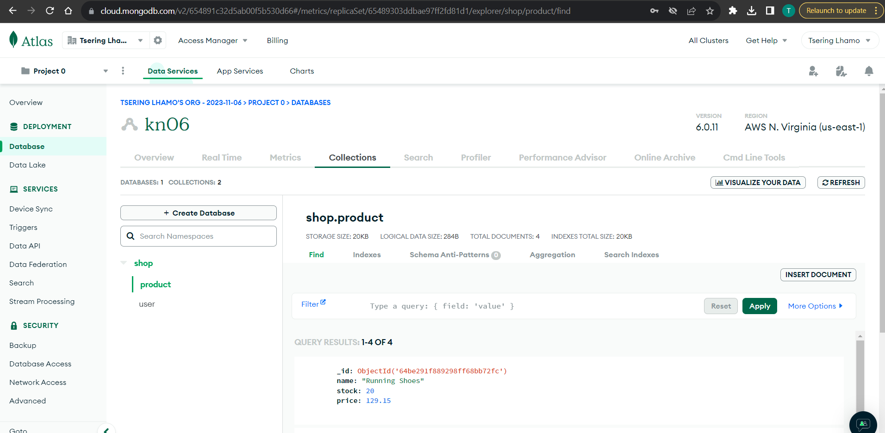
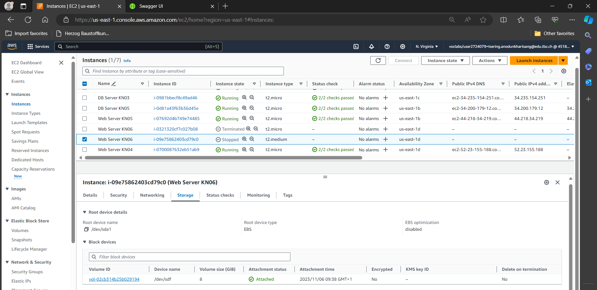
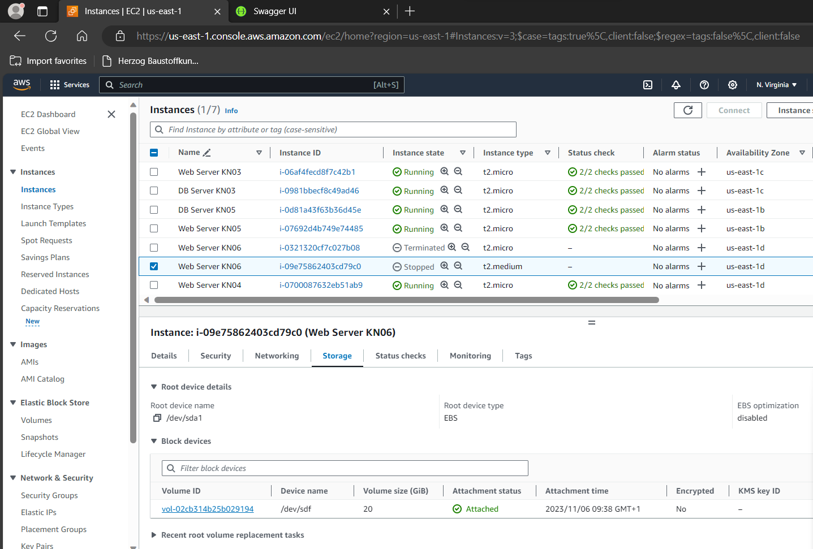
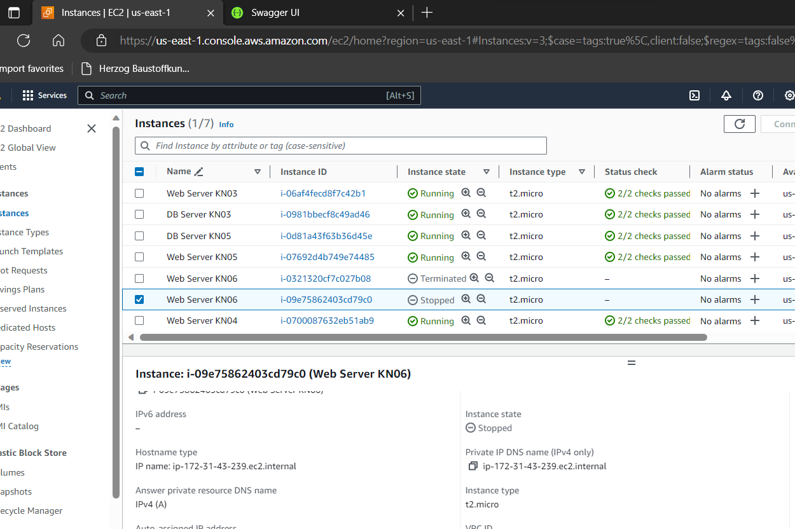
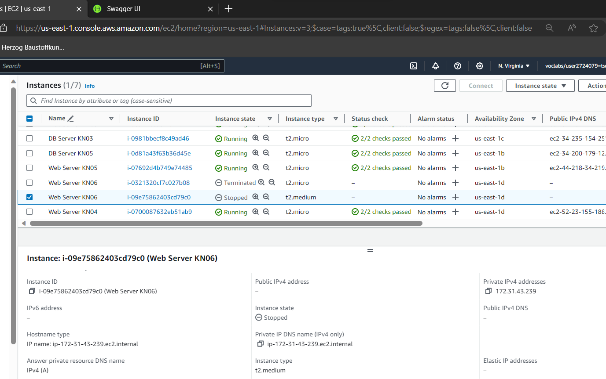

# KN06: Skalierung
## A. Installation App
#### Kurze Erklärung in eigenen Worten was ein Reverse Proxy ist:
Reverse Proxy:  
A reverse proxy acts as an intermediary between clients and web servers, providing benefits like load balancing, security, caching, and improved performance. It is a valuable tool in managing and optimizing the flow of web traffic in complex web applications and server environments.

#### Screenshot der zeigt, dass Sie die Swagger-URL aufrufen können:

#### Screenshot der zeigt, dass sie den Endpoint GetProducts aufrufen können (via Swagger) und auch ein korrektes Resultat bekommen:

#### Screenshot einer der MongoDB Collections mit Auszug aus dem Inhalt:

## B. Vertikale Skalierung
#### Vorher-Nachher Screenshots der Instanz-Ressourcen:
1. Vorher (8GB)  

2. Nachher (208GB)  

#### Schritte erklärungen:
1. Stop the Instance: In order to expand the disk size, you will need to stop the EC2 instance.  
2. Modify the EBS Volume:  
 - Select your EC2 instance from the list.
 - In the "storage" tab, find the root EBS volume attached to your instance.
 - Click on the volume, and in the "Actions" menu, select "Modify Volume."
 - Increase the size to 20GB and click "Modify."
 - Start the Instance: Once the volume modification is complete, start your EC2 instance. Your web server should be up and running with the expanded disk.

1. Vorher (t2.micro)  

2. Nachher (t2.medium)  

#### Schritte erklärungen:
1. Stop the Instance: Like before, you will need to stop your EC2 instance. This will cause a brief service interruption.  
2. Change Instance Type:
 - Select your EC2 instance from the list.
 - In the "Instance settings" tab, find the "Change Instance type" and click on it.
 - Choose the t2.medium instance type and confirm the change.
 - Start the Instance: Once the instance type is changed, start your EC2 instance. It should now be running as a t2.medium instance with the expanded disk.

--> If the instance was not stopped, there could be data loss.

## C. Horizontale Skalierung
#### Nehmen sie an, dass diese Applikation unter der URL app.tbz-m346.ch verfügbar sein soll. Wie müssten Sie den DNS konfigurieren, damit dies funktioniert? Erklärungen verlangt in Git:

1. Route 53 Hosted Zone:
   create a hosted zone for the domain "app.tbz-m346.ch".
2. Create a Record Set:
   In the new hosted zone, create a DNS record set. Choose "CNAME" 
   Record. Leave the name blank. In the "Value" field, enter the DNS name 
   of your load balancer.
3. Save the Record Set.
4. DNS changes can take some time to propagate across the internet, you can access the application at "http://app.tbz-m346.ch," and it should be routed through the load balancer to your EC2 instances.

#### Seien Sie bereit Auskunft zu erteilen über ihr Vorgehen und die erstellten Objekte wie Load Balancer, Target Group, Health Check, IPs, Sicherheitsgruppen, Listener u. a. :

1. <strong>Load balancer: </strong> acts as the single poin tof contact for clients, distributes incoming network traffic across multiple EC2 instances. Increases the availabilty of the Application.  
2. <strong>Target Groups: </strong> grouping of instances that the load balancer routes traffic to.  
3. <strong>Health Checks: </strong> Used to monitor the health and status of instances in a target group to check if they are able to handle traffic.  
4. <strong>Security Groups: </strong> You define inbound and outbound rules in security groups to control traffic to and from your instances. They help ensure network security by permitting or denying specific types of traffic.
5. <strong>Listeners: </strong> Listeners are configurations that specify how the load balancer should handle incoming traffic. You define listeners based on the protocol and port used to route requests to the appropriate target group. A listener is like the person at the entrance who checks your reservation, dress code, or age to determine if you're allowed inside.

## D. Auto Scaling
