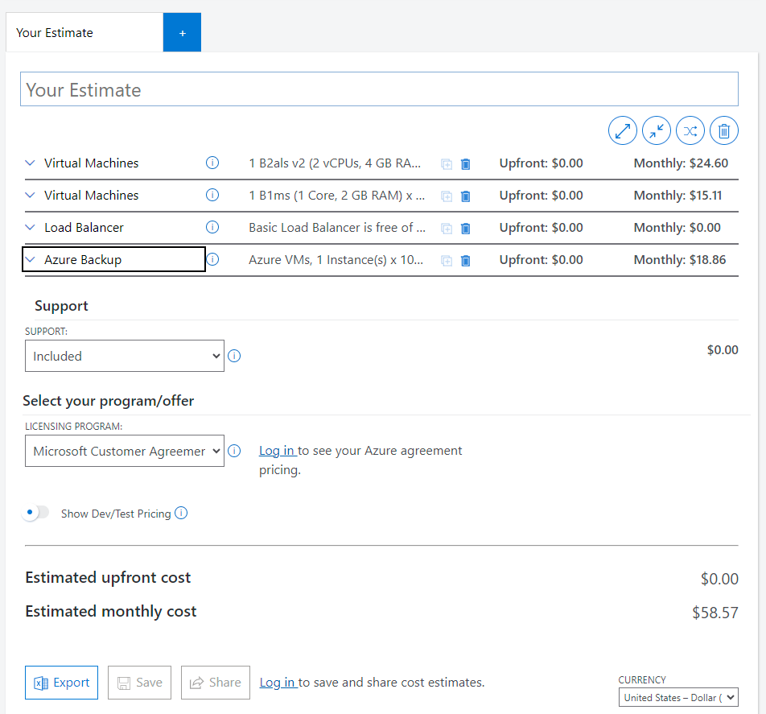
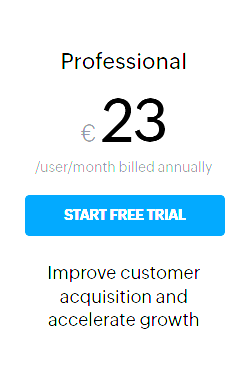
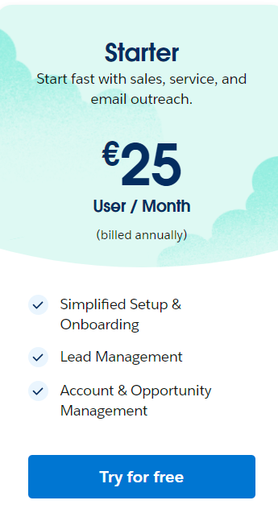

# KN07: Kostenberechnung
## A) Kostenrechnung erstellen 

### 1. Rehosting
Der Kostenrechnungen  
### AWS:

Pros: 
- backup is cheaper than AWS.
- Monthly cost is cheaper than Azure

Cons:
- The total price is much higher than Azure.

### Azure:

Pros:
- Load Balancer is free.

Cons:
- Backup is only 13.86 pricier than AWs.

<strong>Erklärung zu der Auswahl, so dass die Auswahl schlüssig ist: </strong> 
I would choose AWS based on the little price difference between these two.

### 2. Replatforming
1. Screenshot der Kostenberechnungen  
Heroku  

2. <strong>Erklärung zu der Auswahl, so dass die Auswahl schlüssig ist: </strong>
 - Eco and Basic specs are too low. Production offers the ideal plattform type (Business-focused apps, such as customer facing or internal web apps and APIs).
 - Standard 2x is not ideal beacause of the 1GB RAM (required: 2GB RAM) but with the "Perfomance M" 2.5 GB RAM is offered for the price 250 with additional amneties.
- For DB, I chose "Standard 2" because "Standard 0" only has 64 GB storage and the requirement is 100 GB.

### 3. Repurchasing
### Zoho CRM
  
### SalesForce Sales Cloud

 
Zoho is a SaaS. Here it is very easy to set up, it provides ready-to-use softwre applications accessible over the internet. Users don't need to worry about infrastructure or platform management; they can focus solely on using the software.
Heroku is a PaaS. A PaaS sits between laaS an SaaS. It is not as complicated as laaS to set up and often cheaper than a SaaS as long as you don't have to develop the software yourself. 
AWS EC2 is an IaaS. Here we have to configure and set up everything ourself. It is most of the times, the cheapest option. personally, I will choose the AWS EC2 (IaaS).

## B) Interpretation der Resultate

### wie stark unterschieden sich die angebote?
- The price differences are huge. 

### Welches ist das billigste?
-  Rehosting - AWS (55.56/month)
### Wieso ist eines davon viel teurer? Ist es aber wirklich teurer?
- The replattforming with Heroku is the mos expensive (450/month). Because I chose "Performance M", it simplifies the application development and management and other add-ons, it comes with additional cost that can add up. 

