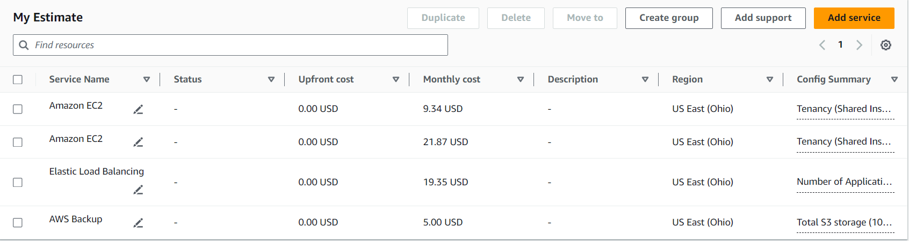
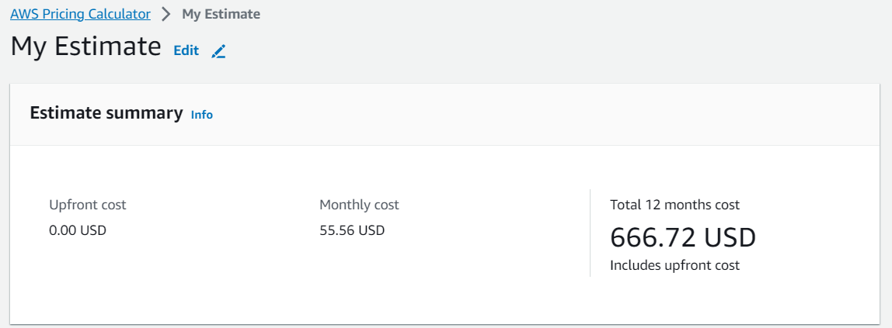
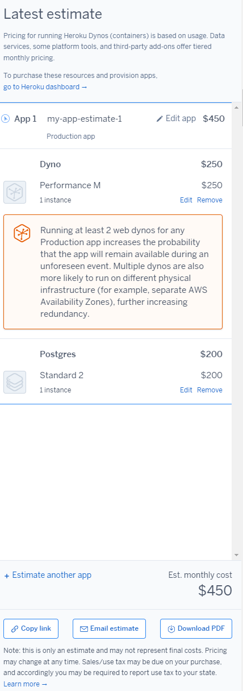

# KN07: Kostenberechnung
## A) Kostenrechnung erstellen 

### 1. Rehosting
abgabe:  
1. Der Kostenrechnungen  
Services:

Estimated Price:

2. <strong>Erklärung zu der Auswahl, so dass die Auswahl schlüssig ist: </strong> 
I chose Amazon EC2 service for both the web server and the db because it best matches the description of a web server with 1 core, 20GB storage, 2GB RAM, and Ubuntu as the operating system and a 1 DB Server wiht 2 Cores, 100GB Storage, 4 GB RAM, Ubuntu as the operating system. And personally I have worked with EC2 in previous tasks.
In the Load Balancer Configuration I specified the Processed bytes (EC2 Instances and IP addresses as targets) value should be 0.5 GB per hour which provides an estimate of the data traffic I expect the load balancer to handle, more than 0.5 would be too much according to the EC2 instances.

### 2. Replatforming
1. Screenshot der Kostenberechnungen

2. <strong>Erklärung zu der Auswahl, so dass die Auswahl schlüssig ist: </strong

### 3. Repurchasing

## B) Interpretation der Resultate

